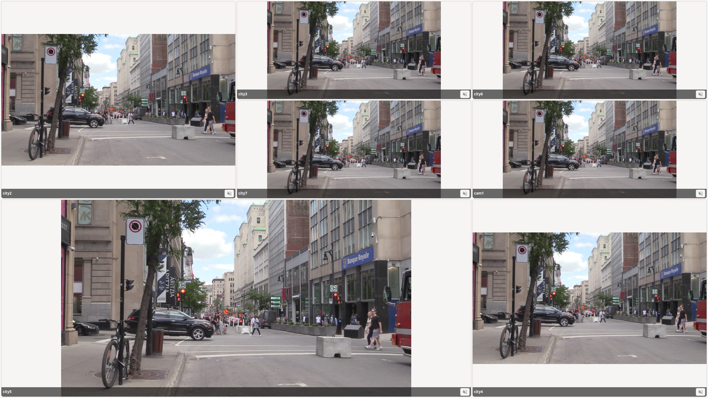

# Camstation

Camstation is a native Linux application for displaying multiple RTSP cameras in configurable grid layouts. The product and technical requirements are in [`spec.md`](spec.md).

## Current status

Camstation provides camera and view management, persistent graphical layouts,
automatic stream recovery, exclusive audio selection, fullscreen kiosk behavior,
and decoder diagnostics for up to ten RTSP streams. Supported Flatpak and native
Nix packages are available alongside a best-effort AppImage beta. The software
package baseline covers H.264, H.265, and MJPEG through GStreamer. Intel VA-API
certification and long-running deployment soak testing remain
environment-dependent follow-up work.



The demo streams shown in the screenshot use [Fake-RTSP-Stream](https://github.com/insight-platform/Fake-RTSP-Stream/) as an image source.

## Prerequisites

The recommended environment is the included Nix flake:

```sh
nix develop
cargo run
```

On a non-Nix development system, install:

- Rust and Cargo
- GTK 4 development files
- GStreamer development files
- GStreamer base, good, bad, ugly, libav, and Rust plugins; with GStreamer 1.28, modern VA decoders are provided by the bad plugin set
- `pkg-config`

Then run:

```sh
cargo run
```

## Configuration and views

Use **Cameras…** to add, edit, test, or remove RTSP cameras. A failed connection test does not prevent saving an unavailable camera. Use **Views…** to create, rename, duplicate, or remove named views, choose their cameras, select the startup view, and configure kiosk-on-start. The view selector in the main window changes the active view.

Configuration is stored at `$XDG_CONFIG_HOME/camstation/config.json`, or at `$HOME/.config/camstation/config.json` when `XDG_CONFIG_HOME` is unset. Writes use an atomic replacement, restrict newly created files to the current user on Unix, and retain the preceding valid file as `config.json.bak`. An invalid existing file is reported and is never silently replaced.

Use another configuration file or override the startup view by UUID or case-insensitive name:

```sh
cargo run -- --config ./cameras.json --view Overview
```

Views store logical grid dimensions and each tile's row, column, and spans. Camstation renders that geometry, and the view manager automatically places newly assigned cameras into free cells.

## Layout editing and kiosk mode

Select **Edit layout** to arrange the active view while its streams continue playing. Drag anywhere on a camera image to move it, drag the **↘** handle to resize it, and use the row and column controls to set the logical grid size. Visible cell guides show where tiles will snap, and **Fit grid** trims empty trailing rows and columns. To add a camera, choose it and then click its desired empty cell. Tiles may have different sizes. Invalid overlaps are rejected and snap back to the previous valid position. Add and remove actions affect only the current view. **Save layout** is enabled after a change and persists the result; **Cancel** restores the original layout. Temporary `--rtsp-url` cameras are hidden while editing because they are not part of the saved view.

Double-click video to expand that camera within the application. Double-click again or press **Escape** to restore the grid.

Press **F11** to enter or leave kiosk mode. Kiosk mode enters fullscreen, hides management controls, and hides the pointer after three seconds of inactivity. `--kiosk` forces kiosk mode, while `--windowed` temporarily overrides a saved kiosk-on-start preference.

See [Unattended startup](docs/unattended-startup.md) for XDG autostart and systemd user-service examples.

Repeated `--rtsp-url` arguments remain available for temporary, non-persisted streams. They are placed in free cells in the selected view:

```sh
cargo run -- \
  --rtsp-url 'rtsp://camera-one.local/stream' \
  --rtsp-url 'rtsp://camera-two.local/stream'
```

## Reliable multi-camera playback

Each tile owns an independent GStreamer pipeline. Failed streams retain their tile and reconnect after `1s`, `2s`, `5s`, `10s`, `15s`, then `30s`; the delay resets after 20 seconds of healthy frame delivery. A watchdog reconnects streams that produce no initial frame for 10 seconds or stop delivering frames for 5 seconds. Changing views or closing the application stops hidden pipelines and releases their timers, bus watches, and frame probes.

All cameras start muted. Enabling a tile's **Audio** toggle first mutes every other camera, so at most one stream is audible. Mute intent survives pipeline reconnection.

Pipelines use RTSP-over-TCP with jitter-buffer latency set to zero, RTSP buffering disabled, stale data dropping enabled, and unsynchronized frame presentation. This favors the lowest practical latency over jitter tolerance and smooth frame pacing. The URL is visible in the add-camera field, but credentials are redacted from routine application logs and pipeline error text.

A working local development stream is available for repeatable playback tests:

```sh
cargo run -- --rtsp-url 'rtsp://127.0.0.1:8554/city-traffic' --log camstation=debug
```

At the time it was added, this H.264 stream reached `Playing` and selected `avdec_h264` on the AMD development workstation.

Use `--kiosk` with startup URLs to hide camera-management controls and open fullscreen:

```sh
cargo run -- --kiosk --rtsp-url 'rtsp://camera.local/stream'
```

## Common commands

```sh
make fmt
make check
make clippy
make test
make test-media
make test-ui
make coverage
make validate-packages
```

See [`docs/testing.md`](docs/testing.md) for the test-suite split, coverage
baseline, and graphical test requirements.

## Distribution packages

Build or run the native Nix package:

```sh
nix build path:.#camstation
nix run path:.#camstation -- --help
```

Build a local Flatpak bundle after installing GNOME Platform and SDK 50 plus
the Freedesktop 25.08 Rust extension:

```sh
make bundle-flatpak
flatpak install --user --reinstall dist/Camstation-0.2.1.flatpak
flatpak run org.camstation.camstation
```

The Flatpak has network, display, GPU, and audio access but no general host
home-directory access. See [`flatpak/README.md`](flatpak/README.md) for details.

An additional AppImage recipe is available for an Ubuntu 24.04 x86-64 build
host:

```sh
make package-appimage
```

The AppImage is a beta artifact. Software decoding is its compatibility
baseline, and current NixOS requires `appimage-run`. See
[`packaging/appimage/README.md`](packaging/appimage/README.md).

The repeatable package checklist is in
[`docs/package-validation.md`](docs/package-validation.md), and the latest
completed/pending matrix is recorded in
[`docs/package-validation-results.md`](docs/package-validation-results.md).

To inspect relevant GStreamer plugins:

```sh
gst-inspect-1.0 gtk4paintablesink
vainfo
gst-inspect-1.0 vah264dec
gst-inspect-1.0 vah265dec
```

GStreamer automatically selects among compatible installed decoders. Camstation recognizes GStreamer's `Hardware` decoder metadata and common VA-API, Intel QSV/MSDK, NVIDIA, V4L2, Vulkan, AMD AMF, and platform decoder factory names. Software fallback is expected when no compatible hardware decoder is registered or when the hardware does not support the stream's codec profile. The Nix shell includes Intel's media driver because Intel is the initial deployment target; other vendors require their corresponding system driver and GStreamer plugin.

## Logging

Camstation uses `tracing`. Set `RUST_LOG` for application logs and `GST_DEBUG` for GStreamer diagnostics:

```sh
RUST_LOG=camstation=debug GST_DEBUG=2 cargo run
```

For unattended kiosk deployments, use `--log-file` to write structured logs to a directory with daily rotation (7 files retained). This prevents unbounded log growth:

```sh
camstation --kiosk --log-file /var/log/camstation
```

If `--log-file` is omitted, logs are written to stderr, which is suitable for systemd journal integration. RTSP URLs may contain credentials and must not be written unredacted to routine logs.

## Optional direnv integration

If `direnv` and `nix-direnv` are installed:

```sh
cp .envrc.example .envrc
direnv allow
```

`.envrc` is intentionally not generated automatically because enabling it is a per-user decision.

## License

Camstation is licensed under the [MIT License](LICENSE). Packaged third-party
components retain their own licenses; see
[`THIRD_PARTY_NOTICES.md`](THIRD_PARTY_NOTICES.md).
